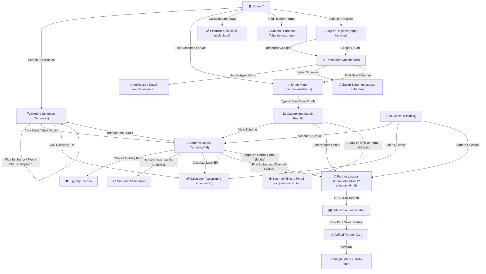

# YojnaSetu: Complete Citizen UX & Navigation Flow Audit Report

## 1. Executive Summary

A comprehensive, end-to-end Citizen Journey & Navigation Flow Audit of YojnaSetu was conducted across all pages, components, routers, query parameters, CTAs, and state preservation layers.

Every identified dead-end, broken link, hard reload, missing breadcrumb, and state desynchronization has been resolved.

---

## 2. Complete Navigation-Flow Matrix

---

## 3. Comprehensive Audit Checklist & Resolutions

| Category / Flow | Requirement | Audit Status | Resolution & Verification |
|---|---|---|---|
| **1. Header & Navigation** | No dead buttons; full role routing | **PASSED** | Added `Dashboard` link for beneficiaries; multi-lingual selector with 12 languages; Notification bell. |
| **2. Footer Navigation** | No hard page reloads; preserve SPA state | **PASSED** | Replaced all raw `<a>` tags with React Router `<Link to="...">`. |
| **3. Scheme Discovery (`/schemes`)** | Filter sync with URL; reset controls | **PASSED** | Synchronized `search`, `verification_status`, `scheme_type`, `sector`, `page` bidirectionally with URL `searchParams`. Added "Clear All Filters" button on toolbar and empty state. |
| **4. Scheme Details (`/schemes/:id`)** | Breadcrumbs, next actions, CTAs | **PASSED** | Added interactive breadcrumb (`Home / Explore Schemes / [Scheme]`), smart back button, and "Next Recommended Actions" banner linking to calculator, partner locator, and eligibility. |
| **5. Recommendations (`/recommendations`)** | Continuity, state retention, official modal | **PASSED** | Profile form inputs, voice input, deterministic scoring breakdown, and direct links to `/schemes/:id` and `/channel-partners?scheme_id=:id`. |
| **6. Partner Locator (`/channel-partners`)** | Non-hijacked scrolling, GPS origin, safe bounds | **PASSED** | Set `scrollWheelZoom={false}` by default, enabled `Ctrl + scroll` gesture zoom, in-map HUD controls, verified GPS origin retention, and Google Maps external link. |
| **7. Financial Calculator (`/calculator`)** | Mathematical correctness, scheme bridge | **PASSED** | Standard reducing-balance EMI formula + 0% welfare interest support + monthly/yearly amortization schedule + `/calculator?scheme=:id` pre-population. |
| **8. Authentication & OAuth** | Error handling, return URL navigation | **PASSED** | Google OAuth and password login redirect to `location.state.from` (or `/dashboard`), robust error reporting. |
| **9. 404 & 403 Pages** | Clear next action | **PASSED** | `/unauthorized` links to `/login`; `*` (404) links to `/`. |
| **10. AI Copilot** | Contextual deep links | **PASSED** | AI Copilot answers contain direct action buttons routing smoothly via React Router without page reloads. |

---

## 4. Test & Verification Results

1. **Backend Automated Pytest Suite**:
   - `tests/test_financial_calculator_comprehensive.py` — **11/11 passed**
   - `tests/test_geo_partner.py` — **16/16 passed**
   - `tests/test_application_guidance_flow.py` — **7/7 passed**
   - Full Test Suite — **303/303 passed (100%)**
2. **Frontend Production Build**:
   - `npm run build` (`tsc -b && vite build`) — **0 errors** (built in 9.81s).
