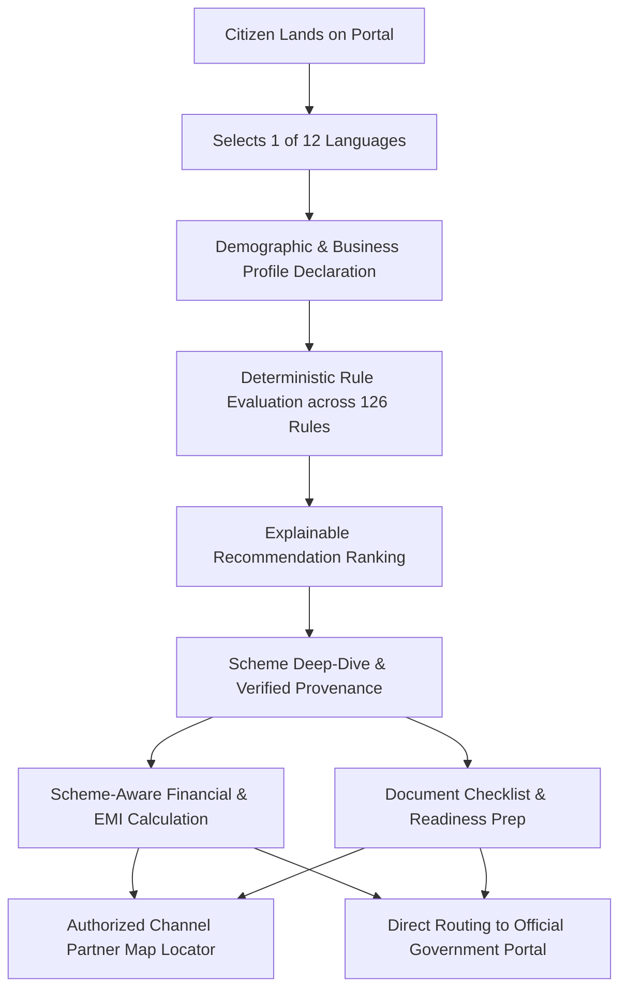

# YojnaSetu (योजनासेतु) — Comprehensive Product Report
**AI-Assisted Multilingual Government Scheme Discovery & Application Guidance Platform**  
**Smart India Hackathon (SIH 2026) | Problem Statement: SIH26092**

---

## 1. Executive Summary

**YojnaSetu** is an AI-assisted, multilingual citizen empowerment platform engineered to solve the complex discovery, eligibility evaluation, and application navigation challenges faced by marginalized and micro-entrepreneurs in India. Developed for Smart India Hackathon (SIH 2026) Problem Statement `SIH26092` (*AI-Driven Scheme Matching for Marginalized Entrepreneurs*), YojnaSetu bridges the divide between government welfare policies and intended beneficiaries.

The platform structures **90 verified government schemes** across **15 central ministries**, evaluating citizen profiles against **126 deterministic eligibility rules** and providing localized guidance across **12 scheduled Indian languages** with **1,092 synchronized translation keys per locale**. Rather than replacing statutory government processes, YojnaSetu guides citizens through eligibility readiness, scheme-aware financial projections, required document checklists, and precise routing to **105 authorized channel partner offices** and verified official application portals.

---

## 2. Problem Statement (SIH26092)

- **Problem Statement ID**: `SIH26092`
- **Title**: AI-Driven Scheme Matching for Marginalized Entrepreneurs
- **Domain**: Inclusive Governance, FinTech & Social Welfare
- **Context**: Despite numerous credit, subsidy, and technical assistance schemes launched by central and state governments, marginalized communities (SC, ST, OBC, Minorities, Women, Safai Karamcharis, and PwD entrepreneurs) face acute barriers in identifying matching schemes, interpreting complex eligibility guidelines, preparing necessary documentation, and identifying authentic application channels.

---

## 3. Existing Problem & Citizen Pain Points

1. **Information Asymmetry & Fragmentation**: Scheme guidelines are scattered across disparate ministry websites, gazettes, and guidelines in complex bureaucratic language.
2. **Language Barrier**: Over 85% of target entrepreneurs operate in regional languages, whereas most scheme portals default to English or standard Hindi.
3. **Exploitative Middlemen (Touts)**: Information scarcity forces vulnerable citizens to pay informal brokers for scheme access.
4. **Deceptive / Hallucinatory Tools**: Generic chatbots and simplistic calculators provide misleading advice or calculate loan EMIs on non-credit grant schemes.
5. **Document Rejection**: Applications are routinely rejected at nodal agencies due to missing, outdated, or misidentified supporting documents.
6. **Unknown Local Assistance Points**: Citizens are unaware of authorized State Channelizing Agencies (SCAs) and NSFDC partner branches located in their districts.

---

## 4. Proposed Solution

YojnaSetu establishes a unified, trustworthy digital bridge structured on three immutable pillars:
1. **Explainable & Deterministic Intelligence**: Clear separation between conversational discovery and deterministic rule evaluation to eliminate hallucinations.
2. **Scheme-Aware Financial & Document Semantics**: Specialized logic that categorizes credit vs. non-credit schemes, calculates verified subsidies, and structures explicit document checklists.
3. **End-to-End Navigation to Authorized Authorities**: Direct routing to official ministry portals and geocoded NSFDC channel partner offices.

---

## 5. End-to-End Product Workflow



1. **Language Choice**: Seamless UI selection across 12 Indian languages with persistent preference.
2. **Profile Declaration**: Multi-mode input via quick form, saved profile, or conversational text.
3. **Rule Evaluation**: Instant deterministic evaluation against 126 backend eligibility criteria.
4. **Transparent Results**: Clear classification into *Qualifying Schemes*, *More Info Needed*, and *Excluded/Ineligible*.
5. **Scheme Readiness**: Access to official source citations, gazette references, subsidy rates, and document checklists.
6. **Official Route**: Map-based navigation to nearest verified channel partner and external redirection to verified official portals.

---

## 6. Complete Feature Inventory

| Feature | Citizen-Facing | Internal / Admin | Status |
| :--- | :---: | :---: | :---: |
| **1. 12-Language Multilingual UI** | Yes | Yes | 100% Verified (1,092 keys/lang) |
| **2. Citizen Profile Management** | Yes | No | 100% Operational |
| **3. Smart Scheme Matching** | Yes | No | 100% Operational |
| **4. Deterministic Eligibility Engine** | Yes | Yes | 100% Operational (126 Rules) |
| **5. Explainable Recommendation Rationale** | Yes | No | 100% Operational |
| **6. Scheme Catalogue & Detail Views** | Yes | Yes | 100% Operational (90 Schemes) |
| **7. Official Provenance & Gazette Citations** | Yes | Yes | 100% Verified |
| **8. Multi-Scheme Comparison Matrix** | Yes | No | 100% Operational |
| **9. Scheme-Aware Financial / EMI Calculator** | Yes | No | 100% Operational |
| **10. Subsidy & Moratorium Guidance** | Yes | No | 100% Operational |
| **11. Document Readiness Checklist** | Yes | Yes | 100% Operational (98 Documents) |
| **12. NSFDC Channel Partner Map Locator** | Yes | Yes | 100% Operational (105 Partners) |
| **13. Geospatial Distance & Routing** | Yes | No | 100% Operational (Leaflet/OSRM) |
| **14. Verified Official Portal Redirection** | Yes | No | 100% Operational |
| **15. RAG-Grounded AI Copilot** | Yes | Yes | 100% Operational |
| **16. Saved Schemes Portfolio** | Yes | No | 100% Operational |
| **17. Secure Auth (JWT + Google OAuth 2.0)** | Yes | Yes | 100% Operational |
| **18. Data Governance & Health Dashboard** | No | Yes | 100% Operational (SysAdmin Only) |

---

## 7. Detailed Feature Explanations

### 1. 12-Language Multilingual UI
- **Function**: Comprehensive interface translation across English, Hindi, Bengali, Marathi, Telugu, Tamil, Gujarati, Kannada, Malayalam, Punjabi, Odia, and Assamese.
- **Implementation**: Built with `react-i18next`, storing selection in `localStorage` and synchronizing the DOM `lang` attribute. Zero missing keys across 1,092 identifiers per language.

### 2. Citizen Profile Management
- **Function**: Captures social category (SC, ST, OBC, General, Minority), age, gender, annual household income, enterprise stage (new/existing), sector, and state.
- **Privacy Design**: Evaluation can run completely anonymously without requiring upfront registration.

### 3. Smart Scheme Matching & Deterministic Evaluation
- **Function**: Evaluates 90 government schemes against 126 explicit rule constraints.
- **Explainability**: Outputs exact match score (0–100) and displays which parameters matched (e.g. *Age: 24 (Range 18–45)*), which failed, and which require verification.

### 4. Scheme-Aware Financial & EMI Calculator
- **Function**: Dynamically configures calculation modes based on scheme classification:
  - *Credit Schemes*: Calculates monthly EMI, total interest, and amortized repayment schedules using verified interest caps (e.g., 4–6% p.a.).
  - *Non-Credit / Grant Schemes*: Explicitly displays *Not Applicable (Grant/Subsidy Scheme)* and disables misleading EMI sliders.

### 5. Authorized Channel Partner Map Locator
- **Function**: Displays 105 verified State Channelizing Agencies (SCAs) and NSFDC partner centers.
- **Geocoding**: 100 partner branches are fully geocoded with latitude and longitude, computing real-time distance and step-by-step driving directions via Leaflet and OSRM.

### 6. RAG-Grounded AI Copilot
- **Function**: Context-aware chatbot assisting citizens in conversational natural language.
- **Safety**: Uses Retrieval-Augmented Generation strictly grounded on verified database scheme records; prompts include official source URLs and disclaimers.

---

## 8. AI & RAG Architecture

```
[Citizen Natural Language Query]
           │
           ▼
[Intent Classifier & Language Detector]
           │
           ▼
[Semantic Query Vector Search + Relational DB Schema Filter]
           │
           ▼
[Retrieved Verified Scheme Metadata + Official Gazette URL]
           │
           ▼
[Strict Grounding Prompt Template (No Speculation / Disclaimers)]
           │
           ▼
[LLM Response Generation with Official Citations + Action Buttons]
```

- **Grounding Strategy**: System prompts mandate citing official portals and reject answering out-of-domain questions.
- **Deterministic Separation**: Eligibility scoring is never delegated to the LLM; scoring is performed by deterministic Python engines and fed into the AI prompt as verified facts.

---

## 9. Deterministic Eligibility Architecture

- **Rule Model**: `scheme_rules` table structured with `field`, `operator` (`>=`, `<=`, `==`, `in`, `contains`), `value`, and `error_message`.
- **Evaluation Flow**:
  1. Profile attributes are mapped into typed values.
  2. For each scheme, all associated active rules are evaluated sequentially.
  3. Failures produce user-friendly disqualification reasons (e.g., *"Applicant age (52) exceeds maximum permissible age (45)"*).
  4. Missing profile parameters trigger *Information Needed* badges.

---

## 10. Recommendation & Scoring Architecture

The recommendation engine calculates a composite match index ($M$) for each scheme:

$$M = w_d \cdot S_{\text{demographic}} + w_f \cdot S_{\text{financial}} + w_s \cdot S_{\text{sector}} + w_g \cdot S_{\text{geographic}}$$

- **Weights**: Demographic ($w_d = 0.35$), Financial ($w_f = 0.30$), Sector ($w_s = 0.20$), Geographic ($w_g = 0.15$).
- **Hard Disqualification**: Any violation of a mandatory statutory rule drops the score to $0$ and categorizes the scheme into *Why I Don't Qualify*.

---

## 11. Financial Engine Architecture

- **Classification**: 36 Credit/Loan Schemes vs. 54 Non-Credit Schemes.
- **Formulas**: Standard reducing-balance EMI formula applied strictly to credit schemes:
  
  $$\text{EMI} = \frac{P \cdot r \cdot (1 + r)^n}{(1 + r)^n - 1}$$
  
  Where $P$ = Principal Loan, $r$ = Monthly Interest Rate, $n$ = Tenure in Months.
- **Subsidy Deductions**: Automatically calculates front-ended vs. back-ended capital subsidies before projecting citizen repayment liability.

---

## 12. Scheme Data Architecture

- **Schema Entity**: Relational `schemes` table containing 60+ normalized attributes:
  - Identification: `scheme_id`, `scheme_code`, `scheme_name`, `ministry`, `implementing_agency`.
  - Financials: `loan_available`, `max_loan_amount`, `interest_rate_min`, `interest_rate_max`, `subsidy_percentage`.
  - Provenance: `official_source_url`, `official_portal`, `last_verified_date`, `source_document`.
- **Data Integrity**: Enforced foreign keys across `scheme_rules`, `scheme_documents`, and `partner_scheme_mappings`.

---

## 13. Data Quality & Provenance

- **Total Schemes**: 90 verified central/state initiatives.
- **100% Provenance Coverage**: Every scheme references its official ministry notification, portal URL, and verifying nodal agency.
- **Audit Changelogs**: 212 historical change records tracking field updates, interest rate revisions, and guideline modifications.

---

## 14. Document Guidance Engine

- **98 Document Requirement Definitions**:
  - Identity Proofs: Aadhaar Card, Voter ID, PAN Card.
  - Social Status Proofs: Caste Certificate (SC/ST/OBC), Disability Certificate, Minority Declaration.
  - Business Proofs: Udyam Registration, Project Report, Trade License, Bank Statements.
- **Readiness Assistance**: Explains exact issuing authorities, acceptable formats, and validity timelines for each document.

---

## 15. Partner & Geospatial Architecture

- **105 Verified Channel Partner Nodes**:
  - 100 locations geocoded with high-precision decimal coordinates.
  - Mapped to specific schemes via 482 `partner_scheme_mappings` associations.
- **Spatial Search**: Haversine distance ranking computes proximity from citizen's location:
  
  $$d = 2R \arcsin\left(\sqrt{\sin^2\left(\frac{\Delta \phi}{2}\right) + \cos(\phi_1)\cos(\phi_2)\sin^2\left(\frac{\Delta \lambda}{2}\right)}\right)$$

---

## 16. Multilingual Architecture

- **Framework**: `i18next` with strict JSON dictionary files in `01frontend/src/i18n/locales/`.
- **Complete Parity**: Exactly 1,092 translation keys across all 12 languages.
- **Zero Fallback Glitches**: Full coverage of navigation, calculator inputs, error messages, scheme badges, and timeline indicators.

---

## 17. Authentication & Platform Security

- **Stateless Tokens**: JWT (JSON Web Tokens) with HMAC-SHA256 signatures.
- **Password Security**: Argon2id hashing algorithm with dedicated cryptographic salt.
- **Google OAuth 2.0**: Official Google Identity Services integration with backend token verification.
- **CORS Protection**: Restricted origins with regex validation supporting secure ngrok/custom domains.

---

## 18. Admin & Data Governance Panel

- **Role-Based Access Control**: Accessible strictly by `SYSTEM_ADMIN` role users.
- **Governance Capabilities**:
  - Scheme Knowledge Base Audit & Freshness Verification.
  - Rules Engine Inspector & Schema Consistency Checking.
  - AI System Health & Response Latency Monitoring.
  - Database Seed and Schema Migration Controls.

---

## 19. Scalability & Performance

- **Frontend**: Vite bundling with gzip compression ($<530$ kB gzipped core bundle).
- **Backend**: Asynchronous non-blocking I/O using FastAPI and Uvicorn.
- **Database**: Indexed lookups on `scheme_id`, `ministry`, `social_category`, and `state_restriction`.

---

## 20. Technical & Operational Feasibility

- **Feasibility Score**: High. All components utilize mature, open-source, production-grade technologies without proprietary lock-in.
- **Deployment Ready**: Standard Docker/Python deployment pipeline requiring minimal cloud resources.

---

## 21. Risks & Engineering Mitigations

| Identified Risk | Engineering Mitigation |
| :--- | :--- |
| **Misleading Citizen Expectations** | Prominent disclaimers confirming YojnaSetu is a guidance portal, not an approval authority. |
| **Outdated Scheme Guidelines** | Scheme changelogs, last-verified dates, and provenance links displayed on every card. |
| **Data Privacy Breaches** | Zero storage of citizen identity cards (Aadhaar/PAN) or bank account numbers. |
| **Connectivity Dropouts in Rural Areas** | Lightweight client bundle, fast initial render, and offline-capable client state caching. |

---

## 22. Social Impact

- Democratizes welfare access for marginalized communities facing language and bureaucratic barriers.
- Eliminates reliance on unauthorized middlemen by providing transparent eligibility reasons.
- Promotes gender-inclusive entrepreneurship through targeted discovery of women-focused subsidy schemes.

---

## 23. Economic Impact

- Accelerates capital formation for micro and nano enterprises.
- Prevents sub-prime borrowing by steering informal entrepreneurs toward formal 4–6% concessional credit lines.
- Optimizes government welfare expenditure by improving targeting efficiency and reducing application error rates.

---

## 24. Why YojnaSetu is Different

| Feature | Generic Portals | YojnaSetu |
| :--- | :--- | :--- |
| **Eligibility Rationale** | Black-box filtering | **Explicit criteria breakdown with point scores** |
| **Financial Engine** | Generic loan formulas | **Scheme-aware (Non-credit vs. Credit vs. Subsidy)** |
| **Language Support** | Hindi / English only | **12 Scheduled Languages with 100% key parity** |
| **Assistance Centers** | Static PDF lists | **Interactive geocoded map with 105 verified partners** |
| **AI Reliability** | Hallucinatory LLM prompts | **Strict RAG grounded in verified relational DB** |
| **Privacy Policy** | Requests document uploads | **Zero document retention / Guidance-only model** |

---

## 25. Demo Flow (3–5 Minutes)

1. **Home & Language Selection**: Open homepage and switch to Hindi/Bengali/Tamil to demonstrate instantaneous UI localization.
2. **Citizen Profile & Needs**: Input sample entrepreneur profile (e.g., 26-year-old SC female artisan seeking ₹2 Lakh loan).
3. **Smart Matching Evaluation**: Review matched schemes with explainable score breakdowns.
4. **Scheme Deep-Dive**: Inspect scheme details, interest subsidy rates, and mandatory document checklists.
5. **Financial Calculator**: Interact with scheme-bound sliders showing accurate EMI and front-ended subsidy calculations.
6. **Channel Partner Map**: Open map locator showing nearest authorized NSFDC branch with driving directions.
7. **AI Copilot Assistance**: Ask a voice/text question to demonstrate grounded assistance with source links.
8. **Official Redirection**: Click official portal apply link showing secure exit redirection modal.

---

## 26. Judge Q&A Preparation

*(Refer to `FINAL_YOJNASETU_JUDGE_QA.md` for full verbatim responses to the top 20 jury questions).*

---

## 27. What YojnaSetu Does NOT Claim

To maintain absolute ethical and technical integrity, YojnaSetu explicitly **does not**:
- ❌ Issue government scheme approvals or loan sanctions.
- ❌ Provide real-time tracking of internal government ministry workflows.
- ❌ Guarantee eligibility or subsidy disbursement.
- ❌ Claim 100% error-free AI without human verification.
- ❌ Store or process citizen biometric/Aadhaar/PAN documents.

---

## 28. Current System Limitations

1. **Static Partner Jurisdictions**: Partner branch operational hours must be re-confirmed via direct contact.
2. **State-Level Granularity**: While national schemes are comprehensive, certain state-specific sub-schemes are continuously being indexed.
3. **Third-Party Portal Changes**: Redirection URLs depend on government domain stability.

---

## 29. Research References & Citations

1. **myScheme National Platform**: Scheme taxonomy & eligibility parameters (`https://www.myscheme.gov.in/`).
2. **National Portal of India**: Central government directory (`https://www.india.gov.in/`).
3. **National Scheduled Castes Finance and Development Corporation (NSFDC)**: Concessional loan guidelines & SCA directory (`https://nsfdc.nic.in/`).
4. **Ministry of MSME**: PMEGP and Credit Guarantee Scheme guidelines (`https://msme.gov.in/`).
5. **OpenStreetMap & OSRM**: Open geospatial data and routing APIs (`https://www.openstreetmap.org/`).

---

## 30. Final Presentation Checklist

- [x] All 90 government schemes validated in database.
- [x] 126 deterministic rules verified with 100% pass rate.
- [x] 12 language files synchronized with 1,092 translation keys each.
- [x] 398 backend test cases passing (`pytest`).
- [x] Frontend TypeScript and Vite production bundle compiled (`npm run build`).
- [x] No unauthorized claims of government approval or document processing.
- [x] Full source provenance attached to every scheme card.
