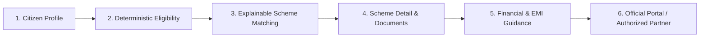

# YojnaSetu — SIH 2026 Presentation Content
**AI-Assisted Multilingual Government Scheme Discovery & Application Guidance Platform**

---

## Slide 1: Title Slide

### **YojnaSetu (योजनासेतु)**
**AI-Assisted Multilingual Government Scheme Discovery & Application Guidance Platform**

- **Smart India Hackathon (SIH 2026)**
- **Problem Statement ID**: `SIH26092`
- **Problem Statement Title**: AI-Driven Scheme Matching for Marginalized Entrepreneurs
- **Theme**: Inclusive Governance & Citizen Empowerment
- **Category**: Software
- **Team Name**: *[Team Name Placeholder]*
- **Team ID**: *[Team ID Placeholder]*

> *"Bridging the gap between 90+ verified government welfare schemes and marginalized citizens through explainable AI, deterministic eligibility matching, and authentic channel partner navigation in 12 Indian languages."*

---

## Slide 2: Proposed Solution & Citizen Workflow

### **Headline**
> *"One guided journey from 'Who am I?' to 'Which scheme fits me?' to 'Where and how do I apply?'"*

### **End-to-End Guided Citizen Workflow**



1. **Citizen Profile**: Quick demographic, social, geographic, and financial self-declaration without mandatory upfront login.
2. **Deterministic Eligibility**: Explicit rule engine evaluates 126 official eligibility rules without hallucination.
3. **Explainable Matching**: Transparent scoring broken down into matched, unmatched, and unspecified dimensions.
4. **Scheme Detail & Documents**: Source-backed scheme parameters and verified required document checklists.
5. **Financial & EMI Guidance**: Scheme-aware financial calculator with semantic handling of non-credit schemes.
6. **Official Routing**: Verified links to official ministry portals and 105 geocoded NSFDC/State Channel Partner assistance centers.

### **Core Differentiating Innovations**
- **Deterministic + Explainable Eligibility**: Rules derived directly from official government guidelines with transparent rationale.
- **Scheme-Aware Financial Semantics**: Non-credit schemes explicitly display `Not Applicable` instead of deceptive ₹0 values.
- **12-Language Continuity**: Real-time localization across 12 scheduled Indian languages with 100% key parity.
- **Official Grounding & Zero Document Storage**: Citizens retain all sensitive documents; guidance routes directly to official authorities.

---

## Slide 3: Technical Architecture & Implementation

### **System Architecture**

```mermaid
graph TD
    Client[Citizen / Entrepreneur] --> Frontend[React 18 + TypeScript + Vite + Tailwind CSS + react-i18next]
    Frontend --> API[REST APIs + JWT / Google OAuth 2.0]
    API --> Backend[FastAPI High-Performance Backend]
    
    subgraph Core Engines
        Backend --> E1[Deterministic Eligibility Engine: 126 Rules]
        Backend --> E2[Recommendation & Scoring Engine: 90 Schemes]
        Backend --> E3[Financial & Semantic Calculator Engine]
        Backend --> E4[Document Guidance & Checklist Engine]
        Backend --> E5[Geo / Partner Routing: 105 NSFDC Nodes]
        Backend --> E6[Database-Grounded AI Copilot / RAG Service]
    end
    
    Core Engines --> DB[(SQLite / PostgreSQL Relational Database)]
    Core Engines --> External[Official Portals + OpenStreetMap / Leaflet Navigation]
```

### **Technology Stack**
- **Frontend**: React 18, TypeScript, Tailwind CSS, Vite, `react-i18next` (12 Locales), Lucide Icons, Leaflet / OpenStreetMap.
- **Backend**: Python 3.10+, FastAPI, SQLAlchemy ORM, Pydantic v2 data contracts, Alembic migrations.
- **Data & Intelligence**: 90 verified government schemes, 126 deterministic eligibility rules, 105 channel partners, RAG-grounded AI copilot.
- **Security & Quality**: Argon2 password hashing, JWT stateless authentication, Google OAuth 2.0, 398 automated pytest suite tests.

### **Key Demonstration Views**
1. **Smart Matching & Eligibility**: Clear criteria breakdown explaining exact qualification parameters.
2. **Scheme Detail & Financial Guidance**: Verified subsidy percentages, moratorium terms, and loan limits.
3. **Channel Partner Map Locator**: Interactive geocoded mapping of nearest authorized assistance centers.

---

## Slide 4: Feasibility, Reliability & Viability

### **Challenges vs. Engineering Solutions**

| Operational Challenge | YojnaSetu Technical Solution |
| :--- | :--- |
| **Complex, Scattered Eligibility Guidelines** | **126 Deterministic Rules**: Evaluates exact age, social category, income, and business stage constraints with zero guesswork. |
| **Language & Literacy Barriers** | **12-Language Multilingual UI**: 1,092 localized keys per language across English, Hindi, Bengali, Marathi, Telugu, Tamil, Gujarati, Kannada, Malayalam, Punjabi, Odia, and Assamese. |
| **AI Hallucination in Welfare Advice** | **Dual Architecture**: AI conversational assistant is strictly grounded on relational scheme data with verified source citations. |
| **Deceptive Financial Calculations** | **Scheme-Aware Financial Classification**: 54 non-credit schemes clearly marked as loan-free; credit schemes bound by verified interest rates. |
| **Finding Genuine Assistance Centers** | **105 Authorized NSFDC Channel Partners**: Geocoded with coordinates and state jurisdiction to prevent fraudulent intermediaries. |
| **Privacy & Sensitive Identity Risk** | **Zero Document Storage**: YojnaSetu organizes checklists and never retains copies of Aadhaar, PAN, or financial records. |

> **Important Boundary**: *YojnaSetu empowers citizens with accurate discovery and readiness guidance; it routes citizens to official portals and does not replace government verification or sanctioning authority.*

---

## Slide 5: Social, Economic & Governance Impact

### **Target Beneficiaries**
- **Marginalized Entrepreneurs**: SC/ST, OBC, Safai Karamchari, Minorities, Women, and PwD business aspirants.
- **Micro & Nano Enterprise Owners**: Artisans, weavers, street vendors, and SHG members seeking working capital.
- **First-Generation Borrowers**: Citizens unfamiliar with complex government schemes and banking documentation.

### **Multidimensional Impact**

```
┌─────────────────────────┐   ┌─────────────────────────┐   ┌─────────────────────────┐
│      Social Impact      │   │     Economic Impact     │   │    Governance Impact    │
├─────────────────────────┤   ├─────────────────────────┤   ├─────────────────────────┤
│ • Multilingual equality │   │ • Faster scheme discovery│   │ • 100% source-backed info│
│ • Transparent eligibility│  │ • Reduced middleman risk │  │ • Explainable decisions │
│ • Demystified documents │   │ • Timely subsidy access │   │ • Zero data fabrication │
│ • Digital empowerment   │   │ • Credit readiness      │   │ • Authorized routing    │
└─────────────────────────┘   └─────────────────────────┘   └─────────────────────────┘
```

- **Social**: Empowers non-English speaking citizens across 12 languages with dignified, transparent access to welfare information.
- **Economic**: Prevents financial exploitation by guiding entrepreneurs directly to authorized low-interest schemes and subsidies.
- **Governance**: Strengthens public trust through full provenance transparency (gazette notifications, official portal links, and nodal ministry attribution).

---

## Slide 6: Research, Citations & References

### **Authoritative Data Sources**
- **myScheme National Portal**: Schema structures, social categorization taxonomy, and central ministry datasets.
- **India.gov.in National Portal of India**: Directory of central and state welfare initiatives.
- **National Scheduled Castes Finance and Development Corporation (NSFDC)**: Official credit schemes and authorized channelizing agency directories.
- **Ministry Portals**: Ministry of MSME, Ministry of Social Justice and Empowerment, Ministry of Finance, Ministry of Rural Development, Ministry of Tribal Affairs.
- **Geospatial & Platform Standards**: OpenStreetMap, Leaflet JS, OSRM routing, Google Identity Services OAuth 2.0.

### **Core Architectural Statement**
> *"YojnaSetu structures authoritative government scheme data into an explainable, deterministic intelligence layer. By separating immutable public facts from citizen readiness guidance, YojnaSetu ensures every recommendation is grounded, transparent, and defensible."*
