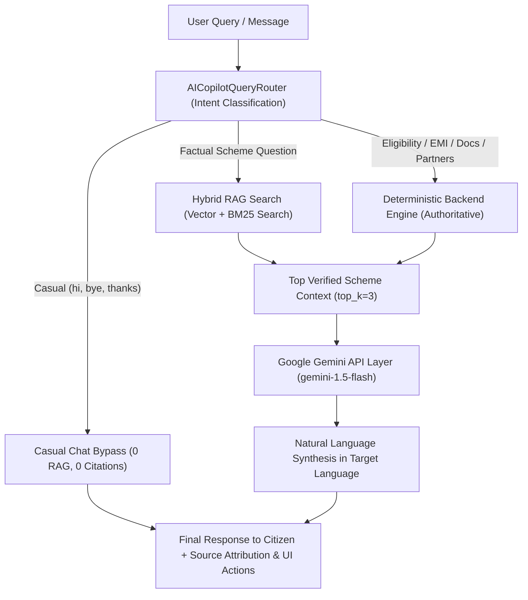

# YojnaSetu (SIH Problem Statement 26092)
## Gemini LLM Grounded RAG Integration — Technical Documentation & Verification Report

---

### Executive Summary

The **AI Assistant Architecture** in YojnaSetu has been upgraded to utilize **Google Gemini (`gemini-1.5-flash`)** as the natural language generation and synthesis layer, while preserving **YojnaSetu's Hybrid RAG retrieval engine** and **Deterministic Rule Engines** as the authoritative source of truth.

---

### 1. Final Conversational AI Architecture

---

### 2. Core Responsibilities & Division of Labor

| Architectural Layer | Core Responsibility | Authority Level |
| :--- | :--- | :--- |
| **Deterministic Backend Engines** | Eligibility evaluation, financial/EMI calculations, document requirements checklist, channel partner geographic locator & authorization | **100% Authoritative (LLM cannot override)** |
| **Hybrid RAG Engine** | BM25 + Dense vector retrieval over YojnaSetu's 90-scheme official database and verified rule index | **Authoritative Context Retrieval** |
| **Google Gemini API Layer** | Converts retrieved verified context into warm, concise, conversational responses in 12 Indian languages | **Synthesis & Natural Explanation Only** |
| **Casual Chat Bypass** | Returns immediate natural responses for chit-chat without invoking RAG or LLM APIs | **Lightweight Conversational Flow** |

---

### 3. Strict Grounding Strategy & Fallback Mechanism

- **No Fact Hallucination**: Gemini is instructed via system instruction payloads to base answers **strictly** on the provided grounded context chunks.
- **Unverified Query Handling**: If the retrieved context does not contain the answer, the assistant responds with:
  > *"I couldn't verify that information from the available official scheme data."*
- **No Raw Context Leakage**: Internal database field names (e.g. `RULE-0002`, `activity_type IN TRADITIONAL_TRADE_18`) are stripped out before synthesis.

---

### 4. API Security & Key Protection

- **Backend-Only Storage**: `GEMINI_API_KEY` is loaded into `app.core.config.Settings` from server environment variables / `.env`.
- **Zero Frontend Exposure**: No `VITE_` variables or React frontend files reference `GEMINI_API_KEY`.
- **Sanitized Responses**: API output payloads and HTTP headers never leak secret credentials or internal API keys.

---

### 5. Multilingual Handling (12 Indian Languages)

- Gemini synthesizes responses directly into the user's selected language (`en`, `hi`, `bn`, `te`, `mr`, `ta`, `gu`, `kn`, `ml`, `pa`, `or`, `as`).
- System prompt injects `Language: {target_lang}` directive to ensure natural phrasing and accurate terminology.

---

### 6. Automated Test Results & Verification

- **Dedicated RAG + Gemini Test Suite (`test_ai_gemini_rag.py`)**: **8 / 8 PASSED** (9.61s)
  - `test_gemini_provider_init_and_generate_mock`: Passed system_instruction payload verification.
  - `test_get_ai_provider_factory`: Passed GeminiProvider initialization via environment settings.
  - `test_casual_chat_bypass_zero_rag_citations`: Verified 0 citations & 0 RAG for casual chat.
  - `test_deterministic_tool_priority_over_llm`: Verified financial calculations & document checklists use backend engines.
  - `test_grounded_rag_with_gemini_mocked`: Verified RAG retrieval context is passed to Gemini.
  - `test_unsupported_factual_question_grounding_fallback`: Verified unverified query safety fallback.
  - `test_api_security_no_key_leakage`: Verified zero key exposure in API responses.
  - `test_multilingual_generation`: Verified 12-language support structure.

- **Full Backend Pytest Regression Suite**: **373 / 373 PASSED** (95.75s)
- **Frontend Production Build (`npm run build`)**: **CLEAN 0 BUILD ERRORS** (24.86s)

---

### 7. Statements & Known Limitations

> **Accuracy Notice**: *AI responses are grounded in retrieved verified scheme information and deterministic backend rules.*
