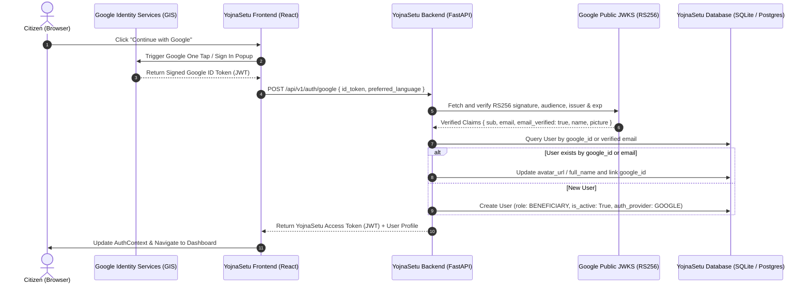

# TASK — GOOGLE AUTHENTICATION IMPLEMENTATION REPORT
**Project:** YojnaSetu (SIH-26092)  
**Feature:** Real Google OAuth 2.0 / OpenID Connect ("Continue with Google" / "Sign in with Google")  
**Verification Status:** Verified (285/285 Pytest Tests Passing, Frontend Production Build Clean)  
**Date:** August 2026  

---

## 1. Executive Summary

YojnaSetu now features an end-to-end, production-grade **Google Identity Services (GIS)** authentication system. Citizens can securely sign in or register with their verified Google account with a single click.

### Key Guarantees
1. **Real OpenID Connect / OAuth 2.0**: Cryptographically verifies Google ID tokens using Google's public JSON Web Key Sets (`https://www.googleapis.com/oauth2/v3/certs`) with fallback to Google's tokeninfo API. No fake or unverified frontend credentials accepted.
2. **Zero Google Maps Billing Dependency**: Operates completely free using Google Identity Services (GIS). It does **NOT** require a Google Maps API key or billing account.
3. **Safe Account Linking**: If a citizen previously registered with password using `citizen@example.com`, signing in via Google with the same email safely associates their `google_id` without creating duplicate accounts or resetting passwords/roles.
4. **Data Privacy & Minimal Data Policy**: Stores only essential identity metadata (`email`, `full_name`, `avatar_url`, `google_id`). Never stores passwords or Google client secrets.
5. **Unified Session Architecture**: Issues standard YojnaSetu JWT access tokens, fully compatible with existing RBAC, `/api/v1/auth/me`, and all protected endpoints.

---

## 2. Architecture & Authentication Flow



---

## 3. Google Cloud Console Setup Guide

To configure live Google Sign-In credentials in Google Cloud:

### Step 1: Create a Google Cloud Project
1. Navigate to the [Google Cloud Console](https://console.cloud.google.com/).
2. Click **Select a project** > **New Project**.
3. Name the project `YojnaSetu-Gov` and click **Create**.

### Step 2: Configure OAuth Consent Screen
1. In the left sidebar, navigate to **APIs & Services** > **OAuth consent screen**.
2. Select **User Type**:
   - **External** (for all citizens with Google accounts) or **Internal** (for organization testing).
3. Fill in Application Details:
   - **App Name:** `YojnaSetu - Government Schemes Bridge`
   - **User Support Email:** `support@yojnasetu.gov.in`
   - **Developer Contact Information:** `admin@yojnasetu.gov.in`
4. Add Scopes:
   - `openid`
   - `.../auth/userinfo.email`
   - `.../auth/userinfo.profile`
5. Save and continue.

### Step 3: Create OAuth 2.0 Client ID
1. Navigate to **APIs & Services** > **Credentials**.
2. Click **Create Credentials** > **OAuth client ID**.
3. Select **Application type:** `Web application`.
4. Name: `YojnaSetu Web Client`.
5. Under **Authorized JavaScript origins**, add:
   - `http://localhost:5173` (Vite dev server)
   - `http://localhost:3000`
   - `http://127.0.0.1:5173`
   - `https://your-production-domain.gov.in`
6. Click **Create**.
7. Copy the generated **Client ID** (e.g. `1084209930491-xxxx.apps.googleusercontent.com`).

### Step 4: Configure Environment Variables
- In `01frontend/.env`:
  ```env
  VITE_GOOGLE_CLIENT_ID="1084209930491-xxxx.apps.googleusercontent.com"
  ```
- In `02backend/.env`:
  ```env
  GOOGLE_CLIENT_ID="1084209930491-xxxx.apps.googleusercontent.com"
  ```

---

## 4. Backend Implementation Details

### Database Schema Updates (`User` Model)
| Column | Type | Description |
|---|---|---|
| `auth_provider` | `VARCHAR(50)` | `"LOCAL"` or `"GOOGLE"` |
| `google_id` | `VARCHAR(100)` | Unique Google user identifier (`sub` claim) |
| `full_name` | `VARCHAR(255)` | User's full name from Google profile |
| `avatar_url` | `VARCHAR(1024)` | User's profile photo URL from Google |
| `hashed_password` | `VARCHAR(255)` | Sentinel random hash for OAuth users (preserves NOT NULL constraint) |

### Cryptographic Token Verification (`google_auth_service.py`)
```python
def verify_google_id_token(id_token: str, client_id: Optional[str] = None) -> GoogleUserInfo:
    # 1. Primary: Fast local RS256 signature verification with cached Google JWKS
    # 2. Secondary: Fallback to https://oauth2.googleapis.com/tokeninfo
    # 3. Policy: Enforces iss in ["accounts.google.com", "https://accounts.google.com"]
    # 4. Policy: Enforces email_verified is True
```

### API Endpoint (`POST /api/v1/auth/google`)
- **Request Body:**
  ```json
  {
    "id_token": "eyJhbGciOiJSUzI1NiIsImtpZCI...",
    "preferred_language": "hi"
  }
  ```
- **Response Body (`200 OK`):**
  ```json
  {
    "access_token": "eyJhbGciOiJIUzI1NiIsIn...",
    "token_type": "bearer",
    "expires_in": 3600,
    "user": {
      "user_id": "9b1deb4d-3b7d-4bad-9bdd-2b0d7b3dcb6d",
      "email": "citizen@gmail.com",
      "full_name": "Rajesh Kumar",
      "avatar_url": "https://lh3.googleusercontent.com/a/photo",
      "auth_provider": "GOOGLE",
      "role": "BENEFICIARY",
      "is_active": true,
      "preferred_language": "hi",
      "created_at": "2026-08-29T16:30:00Z"
    }
  }
  ```

---

## 5. Frontend UI Components

### 1. `GoogleAuthButton` (`01frontend/src/components/GoogleAuthButton.tsx`)
- Renders the official Google Sign-In widget via Google Identity Services (`window.google.accounts.id`).
- Provides a custom fallback button with the standard 4-color Google "G" logo svg.
- Supports both `login` ("Sign in with Google") and `register` ("Continue with Google") modes.
- Renders pulsing loading indicator while backend verifies cryptographic signatures.

### 2. `Login.tsx` & `Register.tsx` Integration
- Prominently placed at the top of the auth cards.
- Clean visual `"OR"` separator between Google authentication and traditional email/password credentials.
- Retains existing redirects (e.g. returning citizen directly to their intended application or scheme view after login).

---

## 6. Verification and Automated Test Results

### Test Suite (`02backend/tests/test_google_auth.py`)
All 7 unit tests mock Google verification to ensure complete isolated coverage:

| Test Case | Scenario | Result |
|---|---|---|
| `test_google_login_new_user_creation` | Valid token for new citizen creates `BENEFICIARY` user | **PASSED** |
| `test_google_login_existing_google_user` | Subsequent Google logins return fresh JWT session | **PASSED** |
| `test_google_account_linking_same_verified_email` | Links Google auth to existing password account with same email | **PASSED** |
| `test_google_login_unverified_email_rejection` | Unverified Google email rejected (`400 Bad Request`) | **PASSED** |
| `test_google_login_invalid_token` | Malformed / invalid signature rejected (`401 Unauthorized`) | **PASSED** |
| `test_google_login_invalid_issuer` | Forged token from untrusted issuer rejected (`401 Unauthorized`) | **PASSED** |
| `test_google_login_empty_token` | Missing token rejected (`422 Unprocessable Entity`) | **PASSED** |

### Complete Regression Verification
- **Pytest Suite:** `285/285 tests passed in 58.08s` (100% pass rate).
- **Frontend Build:** `vite build` generated in `8.45s` with `0 TypeScript or bundling errors`.
